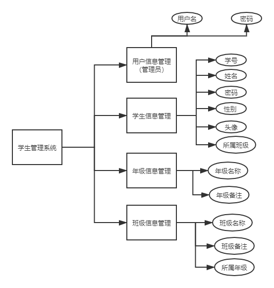
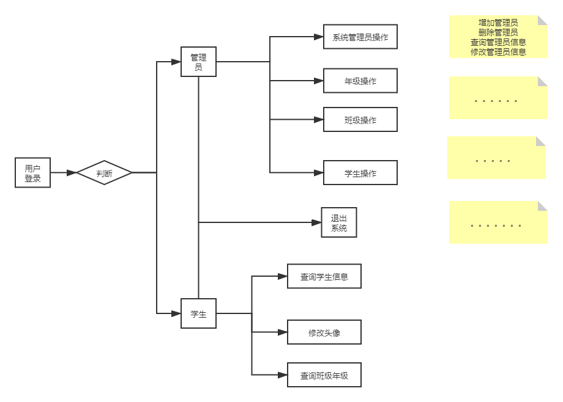

# Student

这是一个简单的SSM架构的学生信息管理系统，作者初衷只是初始SSM框架整合开发。

## :speech_balloon:项目信息

> SSM框架的学生信息管理系统
>
> 系统环境：Windows
>
> JDK版本：jdk13
>
> 开发环境：eclipse 2019-9
>
> 服务器：tomcat7.0
>
> 数据库：mysql5.1
>
> 采用技术：Spring+SpringMVC+MyBatis+Servlet+Jsp+Ajax

## 🙅学生管理系统

**模块属性**



**功能流程**



## 🍓文件结构

> 项目文件

```
+---src
|   +---config
|   |   +---mybatis
|   |   |   \---mapper（映射文件）
|   |   +---spring
|   |   \---springmvc
|   \---vip
|       \---wulinzeng
|           +---controller
|           +---dao
|           +---entity
|           +---interceptor（拦截器）
|           +---page （分页）
|           +---service
|           |   \---impl
|           \---util （工具）
\---WebContent
    +---easyui
    |   +---css
    |   +---js
    |   \---themes
    |       +---default
    |       |   \---images
    |       +---icons
    |       \---locale
    +---h-ui
    |   +---css
    |   +---images
    |   |   \---gq
    |   +---js
    |   +---lib
    |   |   +---Hui-iconfont
    |   |   |   \---1.0.1
    |   |   +---icheck
    |   |   \---jquery
    |   |       \---1.9.1
    |   \---skin
    |       \---default
    +---META-INF
    +---photo
    \---WEB-INF
        +---lib
        \---views
            +---clazz
            +---grade
            +---student
            +---system
            \---user
```

## :key: 数据库

`user`表设计

> user 表是操作管理员，数据存储的是管理员用户

| 列名     | 类型       | 备注                   |
| -------- | ---------- | ---------------------- |
| id       | integer    | 自增，主键，不允许为空 |
| username | vachar(32) | 不允许为空             |
| password | vachar(32) | 不允许为空             |

`grade`表设计

> 年级信息表

|  列名  |    类型     |          备注          |
| :----: | :---------: | :--------------------: |
|   id   |   integer   | 自增，主键，不允许为空 |
|  name  | vachar(32)  | 年级名称列，不允许为空 |
| remark | vachar(512) | 年级备注信息，可以为空 |

`clazz`表设计

> 班级信息表，这里用zz来避免class关键字冲突

| 列名    | 类型        | 备注                                  |
| ------- | ----------- | ------------------------------------- |
| id      | integer     | 自增，主键，不允许为空                |
| gradeId | integer     | 外键，参考年级id，删除更新时 restrict |
| name    | vachar(32)  | 班级名称，不允许为空                  |
| remark  | vachar(512) | 备注信息，可以为空                    |

 restrict：父表在删除和更新记录的时候，要在子表中检查是否有有关该父表要更新和删除的记录，如果有，则不允许删除个更改

`student`表设计

> 学生表，以学生身份登录

| 列名     | 类型         | 备注                                 |
| -------- | ------------ | ------------------------------------ |
| id       | int          | 主键自增，不允许为空                 |
| clazzId  | int          | 外键，参考班级id，删除更新是restrict |
| sn       | varchar(32)  | 学号，由项目util包下随系统时间生成   |
| username | varchar(32)  | 用户名                               |
| password | varchar(32)  | 密码                                 |
| sex      | varchar(8)   | 性别                                 |
| photo    | varchar(128) | 头像，存储地址非二进制文件，         |
| remark   | varchar(512) | 备注，可以为空                       |

`c3p0testtable`

> 数据源

## 🍛功能模块

**🧾系统功能**

- 登录（管理员，学生）功能（已完善）
- 验证码功能（已完善）
- 后台请求拦截器 （已完善）
- 所有查询列表分页显示（以完善）
- 系统错误页面（4xx，5xx）
- 管理员页面 （已完善）
- BGM  （已完善）
- Hitokoto（已完善）

**💁管理员**

> PS：内容涉及 user 表 🚶‍♂️

- 添加管理员用户（已完善）
- 查询管理员用户（已完善）
- 名字模糊查询管理员用户（已完善）
- 修改管理员用户（已完善）
- 删除管理员用户（已完善）

> PS：grade 年级信息表 🏫

- 添加年级（已完善）
- 修改年级信息（已完善）
- 删除年级（已完善）
- 查看年级列表（已完善）
- 模糊查询年级信息（已完善）

> PS clazz 班级表 🏢

- 添加班级（已完善）
- 修改班级信息（已完善）
- 删除班级（已完善）
- 查看班级列表（已完善）
- 模糊查询班级信息（已完善）
- 根据年级查询班级信息（已完善）

> PS  student学生表 👨‍🎓

- 添加学生 （已完善）

- 上传学生头像  （已完善）

- 修改学生信息（已完善）

- 删除学生（已完善）

- 查看学生信息（已完善）

**💆学生**

- 查看自己的学生信息（已完善）
- 修改自己学生头像（已完善）
- 查看年级信息（已完善）
- 查看班级信息（已完善） 

